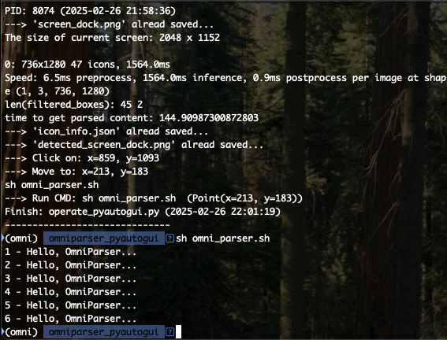

# **omniparser_pyautogui_demo**

## **Integrating OmniParser with PyAutoGUI for automation.**

### **Content** 

* [Ⅰ. Purpose](#1)
* [Ⅱ. Tools or Software](#2)
* [Ⅲ. Statement](#3)
* [Ⅳ. Results](#4)
* [Ⅴ. References](#5)

 

---

<h4 id="1">Ⅰ. Purpose</h4>
This project will provide you with the foundation to integrate OmniParser with PyAutoGUI for automation.
  

<h4 id="2">Ⅱ. Tools or Software</h4>

OmniParser V2, PyAutoGUI.
  

<h4 id="3">Ⅲ. Statement</h4>

The main steps are as follows. 
(1)Use PyAutoGUI to take a screenshot for OmniParser. 
(2)OmniParser scans and parses the image file. 
(3)PyAutoGUI would operate mouse and keyborad according to coordinates converted from parsed content by OmniParser. 
 

<h4 id="4">Ⅳ. Results</h4>

As you can see below, after clicking icon "iTerm" on dock of MacOS, final step would let mouse move to terminal, write shell script command and press "Enter" to execute "omni_parser.sh". Then, the result would be shown on terminal. 

  

__The above provides the foundation to integrate OmniParser with PyAutoGUI for automation. Definitely, that can be expanded, improved and applied. In the future, computers may judge screen content just like humans and then perform targeted operations.__ 

(Concerning to the details, please refer to the files of this project)

 

---

<h4 id="5">Ⅴ. References</h4>

[1] [microsoft/OmniParser
](<https://github.com/microsoft/OmniParser>) 

[2] [microsoft/OmniParser-v2.0](<https://huggingface.co/microsoft/OmniParser-v2.0>)

[3] [Ultralytics YOLO Docs](<https://docs.ultralytics.com/>)

[4] [Welcome to PyAutoGUI’s documentation](<https://pyautogui.readthedocs.io/en/latest/#>)